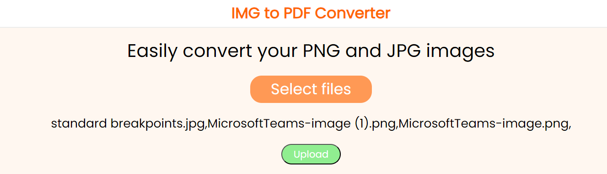
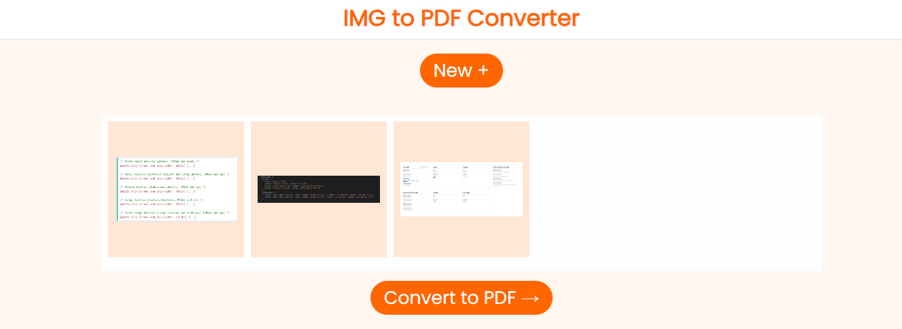
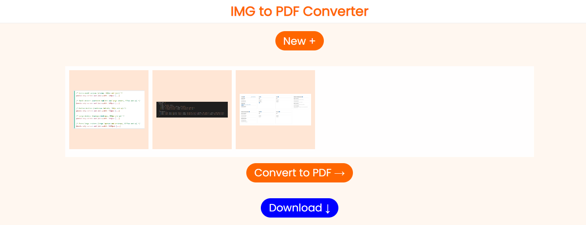

# Image to PDF Converter

An online image to PDF converter built with HTML, CSS, JavaScript, and NodeJS.
This tool is useful because it provides an efficient way to store your images.

## Available Scripts

In the project directory, you can run: npm run devstart

Runs the app in the development mode.
Open [http://localhost:3000](http://localhost:3000) to view it in your browser.

## UI

